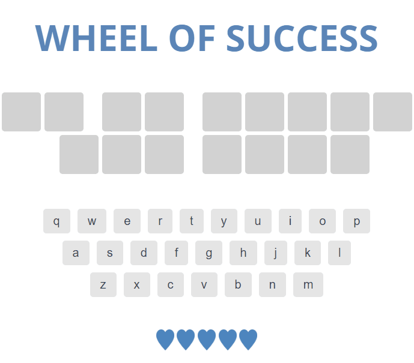

# treehouse-frontend-project06
TreeHouse FrontEnd Project 6 - Game Show App

[Click here](https://canpu.github.io/treehouse-frontend-project06) to view the demo.

## Brief Introduction

* This webpage is a game named *Wheel of Success*.
* For each attempt, a player has 5 lives, and needs to guess what letters are present in a sentence.
* An incorrect guess will cause the player to lose a life.
* If a player has correctly clicked all letters in the sentense before losing all the 5 chances, then the player has won.
* This page does not use responsive design, so please run it on a PC.

## Techniques Involed

* HTML
* CSS
* JavaScript

